# archlinux-hyprland

A complete, from-scratch bootstrap for my Arch Linux + Hyprland desktop.
Run one script on a fresh Arch install and you get the exact same environment:
compositor, bar, launcher, notifications, lock screen, a custom control-center
panel, a wallpaper-driven auto-theming engine, and a macOS-style keyboard layout.

This isn't a minimal "here's my hyprland.conf" dotfiles dump — `install.sh`
installs every package, links every config, and wires up the system-level bits
(SDDM, keyd, optionally the network stack) that a plain symlink script can't reach.

## Screenshots

Real screenshots from this exact config, not mockups. Every accent color
on screen (bar, menus, terminal, lock screen) is extracted from the current
wallpaper by `wall-theme` - change the wallpaper and the whole desktop
recolors to match.

A themed terminal (kitty) with the floating-island bar over the wallpaper:

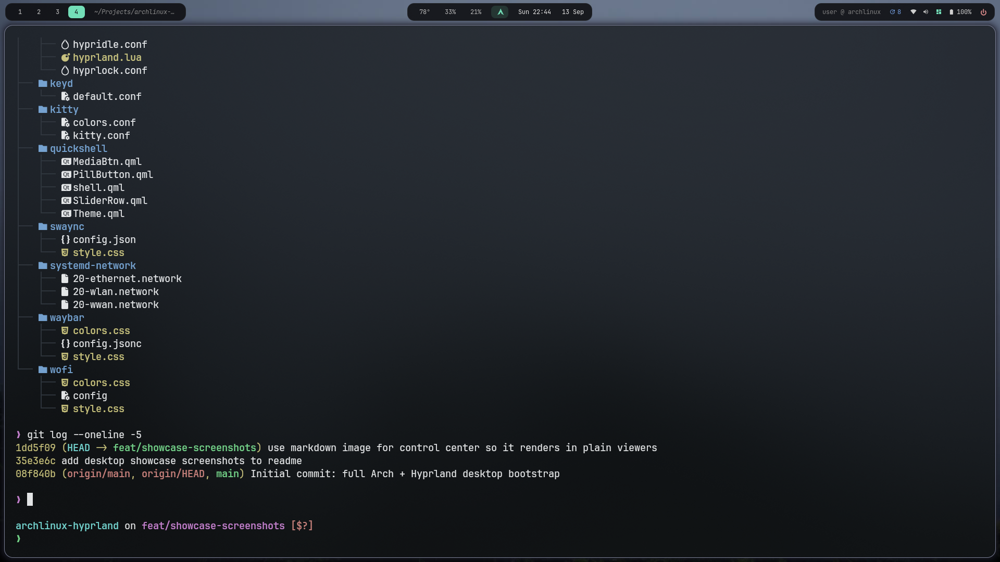

App launcher (Cmd+Space) and the Launchpad-style app grid (Alt+A):

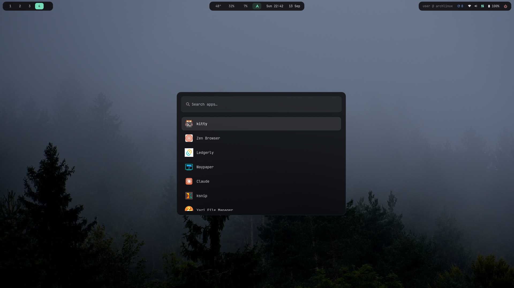

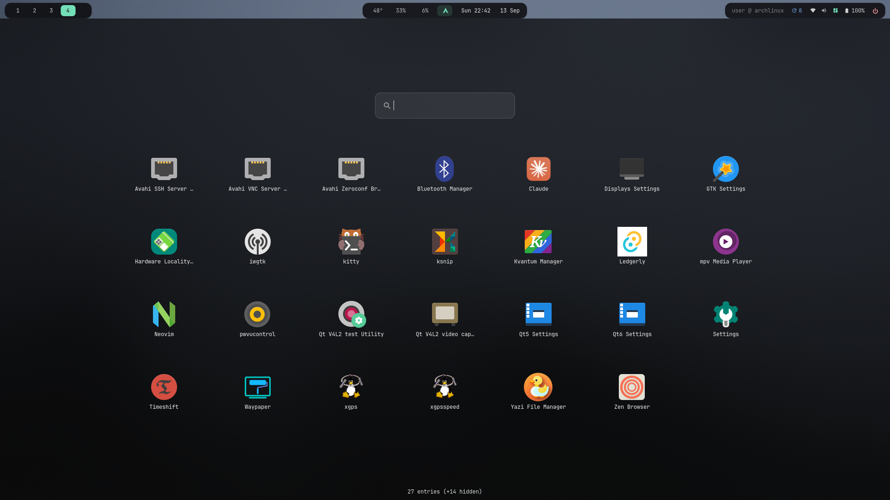

Dropdown quake terminal (Cmd+Shift+Return):

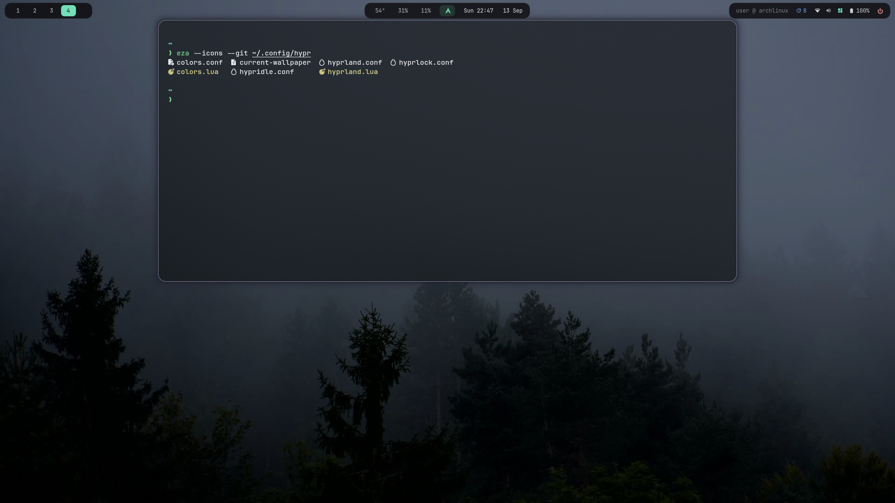

Custom quickshell control center (Cmd+D) - volume and brightness sliders,
wifi/bluetooth/now-playing, and quick toggles - plus the notification
center (Alt+N):

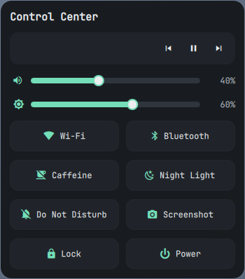

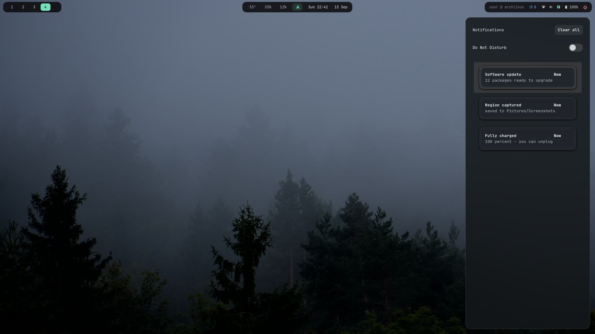

Settings hub (Alt+I), emoji picker (Cmd+Ctrl+Space), and color picker
(Alt+Shift+P):

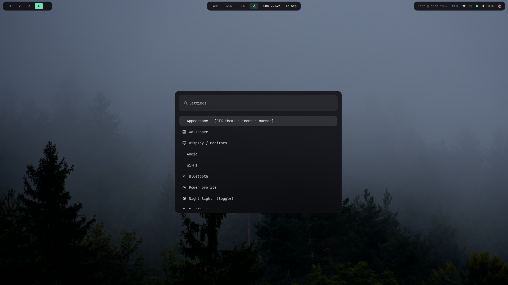

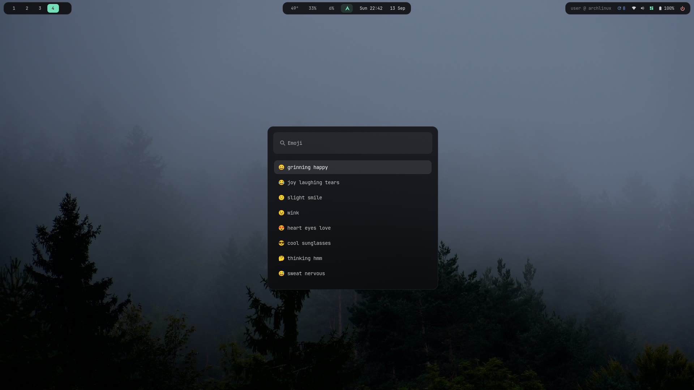

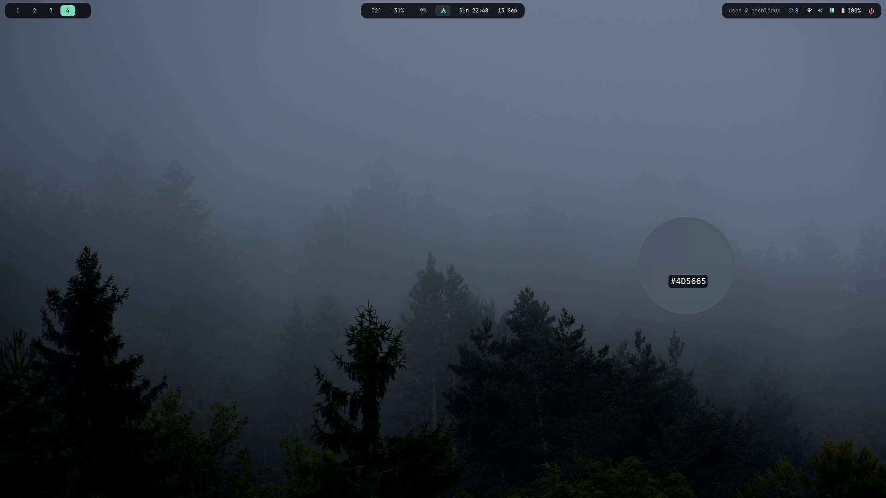

Logout menu (Cmd+Shift+Q) and lock screen (Cmd+Ctrl+Q):

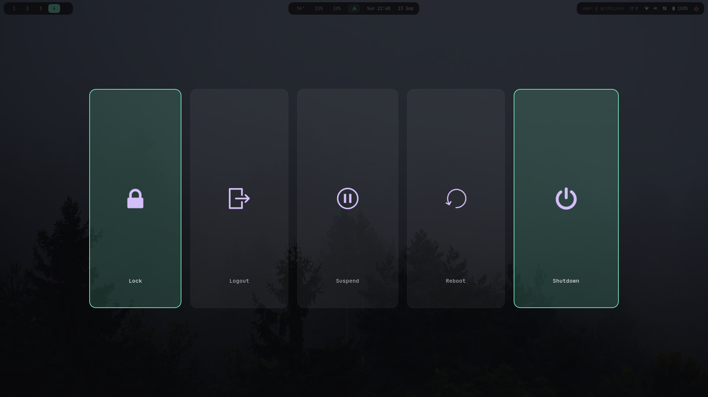

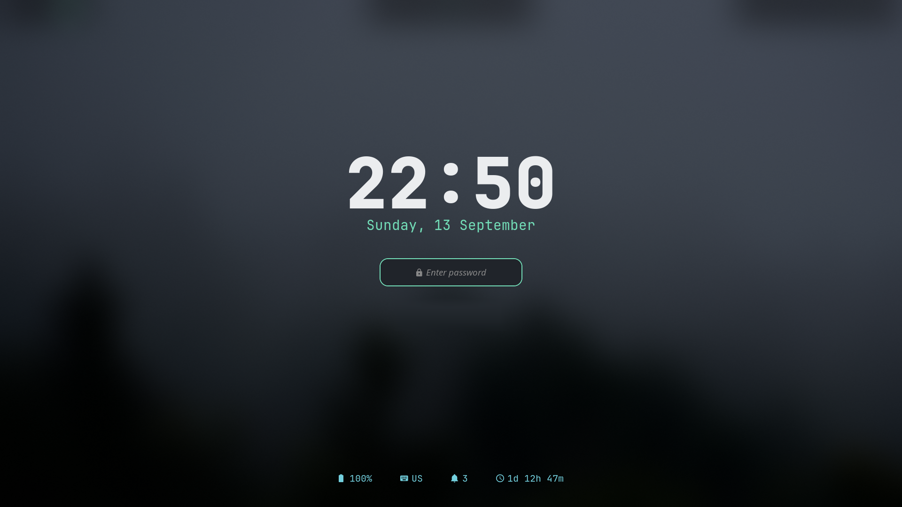

## Quick start

On a fresh Arch install (with a normal, non-root user that has `sudo`):

```sh
git clone https://github.com/dhitalkamal/archlinux-hyprland.git
cd archlinux-hyprland
./install.sh
```

It's interactive by default — it explains each step and asks before anything
opinionated or system-wide. Flags:

- `./install.sh --yes` — skip the "continue?" prompts (the network-stack step
  always asks regardless, since it can drop your connection).
- `./install.sh --skip-packages` — only link configs, don't touch pacman/AUR
  (handy for re-syncing configs on a box that already has everything installed).

Safe to re-run any time: every step is idempotent and backs up whatever it
would otherwise overwrite into `~/.config-backup-<timestamp>/`, never deletes.

## What it sets up

| Piece | Package(s) | Notes |
|---|---|---|
| Compositor | `hyprland` | Config is `config/hypr/hyprland.lua` (Lua config, Hyprland 0.55+) — **not** `hyprland.conf`, which this repo intentionally omits |
| Bar | `waybar` | Floating-island design, live sysinfo, workspace pills |
| Launcher | `wofi` | ⌘Space |
| Notifications | `swaync` | Not `mako` — swaync is the daemon actually running |
| Lock screen | `hyprlock` | Escapes dynamic text to avoid pango-markup crashes (see comments in `hyprlock-status`) |
| Idle daemon | `hypridle` | Installed but **disabled** — see [Opinionated choices](#opinionated-choices) |
| Control center | `quickshell` | Custom-built QML panel — volume/brightness sliders, wifi/bluetooth/now-playing, quick toggles. Toggle: ⌘D |
| Terminal | `kitty` | macOS-style copy/paste bindings |
| Login manager | `sddm` + `sddm-astronaut-theme` (AUR) | Enabled by `scripts/04-sddm.sh` |
| Keyboard remap | `keyd` | macOS SUPER/⌘ layer — see below |
| Wallpaper | `awww` (images), `mpvpaper` (video) | Picked via `waypaper` (AUR), themed by `wall-theme` |
| Theming engine | `local/bin/wall-theme` | Extracts a palette from the current wallpaper (pure stdlib + ffmpeg) and regenerates colors for Hyprland/Waybar/wofi/kitty/swaync/GTK/quickshell |

Full package lists: [`packages/pacman.txt`](packages/pacman.txt) and
[`packages/aur.txt`](packages/aur.txt) (installed via `yay`, bootstrapped
automatically if it isn't already present).

## Repo layout

```
install.sh                 entrypoint — runs scripts/ in order
scripts/
  lib.sh                    shared helpers (logging, backup-before-link, confirm)
  01-packages.sh             pacman + yay bootstrap + package installs
  02-link-configs.sh         symlinks config/ -> ~/.config, local/bin -> ~/.local/bin
  03-keyd.sh                 [asks] installs the keyd remap to /etc/keyd
  04-sddm.sh                 [asks] enables SDDM + astronaut theme
  05-network.sh              [always asks] optional switch to iwd + systemd-networkd
  06-claude.sh               symlinks claude/.claude/* -> ~/.claude
config/                     mirrors ~/.config/<app> — each app dir is symlinked whole
local/bin/                  ~/.local/bin scripts, symlinked individually
claude/.claude/             Claude Code config — see "Claude Code setup" below
packages/                  pacman.txt / aur.txt package lists
```

Why whole-directory symlinks for `config/*` but per-file for `local/bin/*`:
each `config/<app>` dir is fully owned by this repo (nothing else should live
there), but `~/.local/bin` is a general-purpose personal-scripts folder that
may already contain unrelated tools, so only the known scripts get linked.

One nice side effect of whole-directory linking: `wall-theme` writes its
generated color files (`colors.conf`, `colors.css`, `gtk.css`, `Theme.qml`,
`swaync/style.css`, ...) straight into paths that live inside the symlinked
repo directory — so if you like a wallpaper's palette, `git add`/`commit` from
inside `~/.config/hypr` (etc.) picks it up like any other repo file.

## Claude Code setup

`claude/.claude/` is a full Claude Code config, linked into `~/.claude/` by
`scripts/06-claude.sh`:

| Piece | Purpose |
|---|---|
| `CLAUDE.md` | Global rules: execution-mode detection (interactive/headless/routine/ci), the PROCEED gate for interactive sessions, package manager/architecture/TDD/git conventions, zero-decoration writing style |
| `hooks/` | Enforcement at the tool-call layer: blocks force-push and destructive SQL/`rm -rf`, gates writes to the live hook/agent/CLAUDE.md paths (drafts must go through `~/.claude/pending/` first), auto-rebases before push, checks file size and decorative characters |
| `agents/` | `strategist` (long-horizon), `devils-advocate` (adversarial), `researcher` (evidence), `conductor` (multi-repo dispatch), `eval-runner` (self-improvement loop runner) |
| `commands/council.md` | `/council` — 3-round adversarial decision process with mandatory dissent recording, for genuinely uncertain and hard-to-reverse calls only |
| `evals/`, `headless/` | Eval-loop and headless (`claude -p`) task specs |
| `orchestration/orchestrator.md` | Multi-repo coordinator spec; runtime state lives in `~/.claude/orchestration/state.json` (machine-local, not repo-tracked — add repo names there to enable the routines below) |
| `routines/` | Specs for `morning-brief`, `nightly-pr-triage`, `weekly-deps-audit` — read-only reporting jobs. These are specs only; wire them to an actual schedule yourself (cron, systemd timer, or Claude Code's own scheduler) |
| `statusline.sh` | Context-usage / cost / branch / model status line |

`~/.claude/pending/{hooks,skills,agents}/` are created but never repo-tracked —
they're where agent-drafted tooling changes land for human review before
promotion into `claude/.claude/`.

## Opinionated choices

These are genuinely my preferences, not universal defaults — shipped as-is per
design, but flagged here so you can revert anything you don't want:

- **No idle behavior at all.** `hypridle` is installed but never autostarted
  (commented out in `hyprland.lua`'s autostart list) — no dim, no auto-lock,
  no screen-off, no suspend. If you want a middle ground, re-enable the
  `hypridle` line in `hyprland.lua` and adjust `config/hypr/hypridle.conf`
  (a single lock-only listener is the easiest safe default to add back).
- **macOS-style keyboard remap (`keyd`).** SUPER acts as ⌘ Command: `⌘C/V/X/A/Z/S/F/G/L/N/O/P/R/T/W/B/I/U`, `⌘-`/`⌘=`/`⌘0` (zoom), `⌘,` (preferences) get rewritten to their `Ctrl+`
  equivalent so apps see native shortcuts. Space/Return/Tab/`` ` ``/Escape/Q/E/H/digits/arrows/Print/F-keys are deliberately left alone — Hyprland binds
  those directly. `scripts/03-keyd.sh` asks before installing this; instant
  rollback is `sudo systemctl stop keyd`.
- **iwd + systemd-networkd instead of NetworkManager.** `scripts/05-network.sh`
  always asks before doing this (even with `--yes`) because it can drop your
  connection on hardware/configs (VPNs, enterprise wifi) this wasn't tested
  against. Skip it and everything else here still works fine on top of
  NetworkManager — you'll just lose the waybar network click → `iwgtk` GUI
  integration (iwgtk is iwd-only).
- **ALT is the window-management modifier**, freed up from SUPER specifically
  so keyd's ⌘-remap and Hyprland's window binds don't collide.
- **macOS-style dynamic workspaces.** `local/bin/dynamic-workspaces` keeps your
  occupied workspaces numbered 1..N with no gaps: close the last app on a desktop
  and it stays until you switch away, then Hyprland removes it and the rest
  renumber to stay contiguous. Started from `hyprland.lua` autostart.
- **Screenshots go through `local/bin/screenshot`** (grim/slurp/swappy),
  mirroring macOS: ⌘Shift 3/4 save full/region to `~/Pictures/Screenshots`,
  add Ctrl to copy to clipboard, ⌘Shift 5 opens a menu, ⌘Shift 6 grabs a window.
- **The bar uses waybar's `ext/workspaces` module**, not `hyprland/workspaces`,
  so clicking a workspace number activates it over the wayland protocol. This is
  required because this Lua-config Hyprland rejects plain `hyprctl dispatch`
  (all dispatches must use the `hl.dsp.*` form).

## Keybind highlights

Full list lives in `config/hypr/hyprland.lua`; a searchable cheatsheet is
bound to **⌘/** (`keybind-help`, backed by wofi). Some of the notable ones:

| Bind | Action |
|---|---|
| ⌘Space | Launcher (wofi) |
| ⌘Return / ⌘⇧Return | Terminal / dropdown quake terminal |
| ⌘D | Toggle the quickshell control center |
| ⌘⌃Q | Lock screen |
| ⌘⇧Q | Logout menu (wlogout) |
| ⌘E | File manager |
| ⌘Q | Close window |
| ⌘Tab / ⌘⇧Tab | Cycle windows |
| ALT + hjkl / arrows | Focus window in direction |
| ALT + SHIFT + hjkl | Move window in direction |
| ALT + F | Fullscreen |
| ⌘ Shift 3 / ⌘ Shift 4 | Screenshot full / region -> file (add Ctrl to copy to clipboard instead) |
| ⌘ Shift 5 | Screenshot menu (full / region / window, plus screen record) |
| ⌘ Shift 6 | Screenshot a window -> file |
| ⌘ Left / ⌘ Right | Previous / next desktop |

## Post-install

- **Reboot** (or at minimum re-login) so SDDM/keyd/network changes and a fresh
  Hyprland session all take effect together.
- Set a wallpaper with `waypaper` (or drop a file and point
  `~/.config/hypr/current-wallpaper` at it) — `wall-restore` reapplies it at
  login, `wall-next`/`wall-cycle` rotate through a folder, and every change
  re-runs `wall-theme` to recolor the whole desktop.
- Pick an SDDM style by editing `ConfigFile=` in
  `/usr/share/sddm/themes/sddm-astronaut-theme/metadata.desktop` (see that
  theme's `Themes/*.conf` for the available styles). Preview one without
  logging out: `sddm-greeter-qt6 --test-mode --theme /usr/share/sddm/themes/sddm-astronaut-theme`.

## Credits

Built around [Hyprland](https://hyprland.org), [Waybar](https://github.com/Alexays/Waybar),
[Quickshell](https://quickshell.org), [swaync](https://github.com/ErikReider/SwayNotificationCenter),
and [sddm-astronaut-theme](https://github.com/Keyitdev/sddm-astronaut-theme). MIT-licensed — take
whatever's useful, no attribution required.
